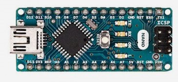
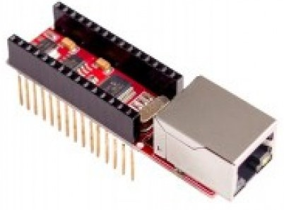
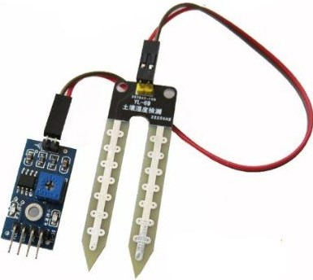

Jardin connecté Arduino version nano !
===================

Bonjour, voici mon projet de jardin connecté d'appartement à base d’arduino nano.

Contexte du projet
-------------
Je vis en appartement et j'aime bien faire un peu de jardin.
Impossible direz-vous ? Et bien non :-) c'est tout à fait possible. et en plus c'est sympa de manger le basilic ou les tomates cerises qui ont poussé ... dans ce petit jardin.

Donc si on liste les objectifs : 
 - Suivre l'état du jardin (humidité du sol).
 - Pouvoir arroser à distance le jardin. (Petite cuve de 10L + pompe aquarium + système de goutte à goutte)
 - surveiller ne niveau d'eau dans la cuve.
 - Remonter les information à ma box Domotique.

Présentation 
------------

 - 1 x Arduino nano
 - 1 x Arduino Ethernet Hanrun
 - 4 x modules de test d'humidité du sol
 - 1 x capteur de niveau d'eau à 5 niveaux (6 fils)
 - 1 Prise commandée gérée par la box domotique pour piloter l'arrosage

Le besoin
-------------
Expression du besoin :

 - Mesurer l'humidité du sol sur plusieurs bacs
 - Mesurer le niveau d'eau dans la cuve (par pas de 20%)
 - Envoyer des notifications régulières à la centrale domotique (raspberry Pi + [Domoticz](https://domoticz.com/))
 - Exposer une mini page web très basique pour afficher les mesures
 

